# 2025 年终总结：降噪、重构与长期主义

过了圣诞，接着就是元旦。刚才试着口述梳理思路，录到一半被猫打断，喂完罐头回来继续写。

站在 2025 的尾巴上，回看这一年，如果说去年是在“寻找”，那今年就是在“确认”。

## 1. 工作与开源：拥抱 AI 的二重奏

今年的技术回顾可以概括为：**工作在新环境，在开源修修补补，全面拥抱 AI。**

**K8s：痛点即是支点**
上半年转岗到了新部门，全面拥抱 Kubernetes。K8s 的水很深，但在日常搬砖中，我发现流程上有很多让人难受的痛点。作为一个工程师，忍受重复性的痛苦比写代码更难受。于是，没忍住手痒，在内部造了一个针对这些痛点的“轮子”。

起初也就是想着自己用着顺手，没想到组里的同事开始试用，不仅没觉得是“重复造轮子”，反而开始给这个项目提 PR。看着内部仓库的 Commit 活跃起来，大家为了同一个工具去优化、去讨论，这种在公司内部建立起的“内部开源小圈子”氛围，反而是今年工作中最大的成就感来源——它让枯燥的工作有了意义。

**Air 的回归与 AI 的加持**
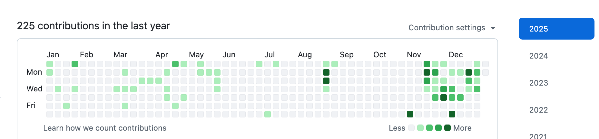
开源方面，前段时间听了 **Terry** 的一个 Talk，他说即使再忙，“每天哪怕只提一个 PR”。这句话像个钩子，把我重新拉回了 GitHub，强迫自己重新捡起 `air` 的维护工作。
但在维护过程中，也生出一种很深的无力感。经常是修了一个复杂的 Bug，满心欢喜地提了 PR，结果发现提 Issue 的用户压根不关心你的代码写得多优雅，他们只在乎：“这玩意儿能不能跑？Bug 没了没？”

好在，AI 成了我的新伙伴。年初开始更高强度地使用 **Code Agent** 和 **AI Deep Search**。
*   **代码助手**：OpenAI 的 Codex 和 Cloud Code 成了我的左膀右臂。
*   **Deep Search**：不管是选品买东西，还是查技术文档，找餐厅，只要我提出需求，AI 就能帮我过滤噪音，直接给答案。
这让我对生活和工作都有了新的掌控感。

## 2. 投资：理性与运气

**回报率 17%：没有追上大盘**

今年美股账户的年化收益率大概在 **15%-17%** 左右。
回想 2021 年下半年入场时，经历过各种震荡，最惨的时候满仓 QQQ 浮亏 40%。好在我一直相信美股的韧性，那是实打实的科技生产力。我相信所有从美股流出的钱最后都会留回来。 
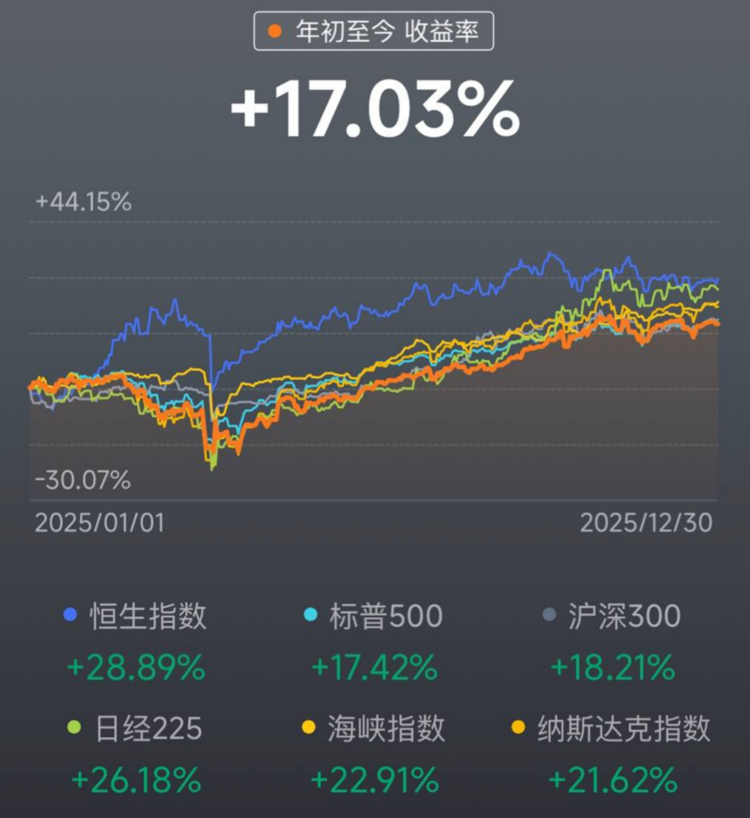  

**现在的持仓与策略**
目前主要持有 **SMH**（半导体）、**QQQ**（科技股）、**SPY**（标普500），为了对冲风险，还配了一点黄金。
我的投资哲学很简单：**如果一只股票比我上次卖出时涨了 30%，我就卖掉 1/3。**
这是一种强迫止盈的纪律。虽然可能会错过一部分的暴涨，但我希望手里永远有现金（子弹）。在没有涨跌幅限制的市场里，手里有钱，心里不慌，这也是对自己心态的一种保护。

## 4. 朋友：不强融，只共振

**拒绝强行融入**
以前可能还会焦虑要不要去参加个羽毛球社团、硬着头皮混进本地人的圈子。今年彻底想通了：**绝不强行融入。** 任何需要你伪装自己去迎合的圈子，都不值得进。

**代码是通用的语言**
今年的新朋友，全是靠技术“味儿”吸过来的，主要就两类：**开源社区** 和 **Vim/Neovim 圈子**。

*   **臭味相投的朋友**：有个从国内来的哥们，我俩简直是世界上另一个我。技术栈一样，审美一样，连用的工具都一样。见面根本不需要寒暄，直接互相安利工具，那种默契太爽了。
*   **本地朋友**：有个新加坡本地小哥，给我发邮件聊开源项目，后来约在线下 Meetup 见。聊开了发现，他对技术的热情跟我一模一样。
*   还有因为吐槽公司楼下面包店在推特认识的其他部门的同事。

## 5. 消费与生活：解决痛点，而非制造需求

今年买的东西不多，但每一件都极大地改善了生活质量。核心逻辑是：**不为溢价买单，只为痛点付费。**

*   **石头扫地机器人**：买的是老款技术版（科沃斯海外对标款）。原因很简单：国内品牌出海到新加坡，价格直接翻两三倍，实在当不了那个冤大头。选了个技术成熟的老款，虽然维护起来麻烦点（像修大爷一样伺候它），但确实把地板弄干净了，这就是技术的胜利。
*   **折叠自行车**：听了推特上坡友的建议入手的。新加坡晚上的风很凉快，雨后的空气也很清新。每天下班或者周末，骑着它穿梭在新加坡的街头巷尾，去探索那些游客绝对不会去的角落。这不仅是交通工具，更是我的“城市探针”，也是排解无聊的最佳方式。
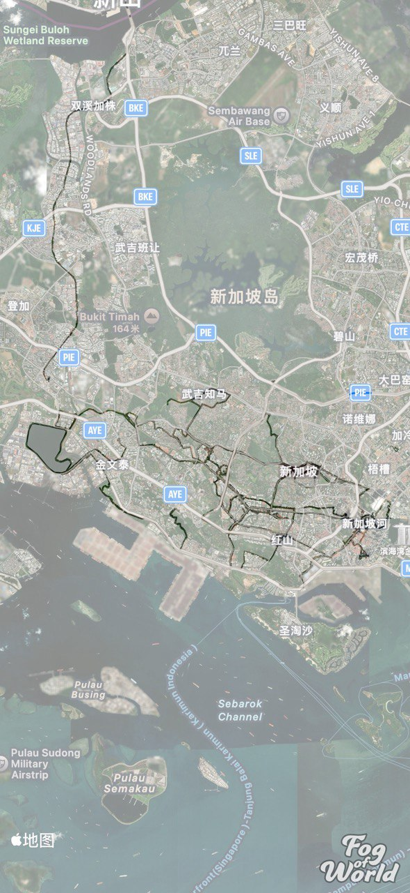
*   **烘干机**：这是今年最伟大的投资。之前为了省钱手动晾衣服，硬生生熬了两年，每天看天吃饭，还得跟潮湿作斗争。买了烘干机后，虽然费点电，但再也不用因为晾衣服这件破事跟太太吵架了。**花钱消灾，值。**
*   **HHKB 键盘**：在日本顺手带回来的。比新加坡便宜了 100 多新币。爽！

**来财：黑色的治愈力量**
家里多了一位原住民，一只黑色的德文卷毛猫，取名“来财”。因为这样的话我呼唤我家猫的时候就可以唱歌词了，“来财，来！来财，来！”
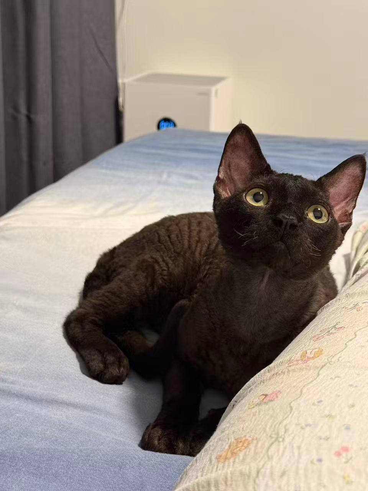
起初我是反对养猫的，觉得麻烦。但当这只小家伙第一天晚上钻进我被窝，后来每天晚上都非要贴着我睡的时候，我彻底沦陷了。它不仅是宠物，更是家人。在这个充满不确定性的世界里，它提供了最确定的情绪价值。

## 6. 2025，玩家的黄金年代

今年花在游戏上的时间比以往都多，算是彻底玩爽了。

*   **《空洞骑士：丝之歌》**：这游戏就是“手残劝退器”。任务指引做得非常隐晦，你要是不动脑子瞎逛，那真的很累，而且难度比一代高出好几个档次。不夸张地说，这游戏如果不开手柄宏，纯手搓简直没法玩。但跨过那个门槛后，它就是当之无愧的年度最佳。
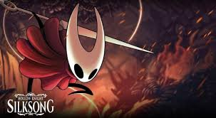
*   **《第一狂战士：卡赞》**：可能是今年玩过最累的一款。它的格挡机制很有《只狼》的味道，判定很宽松，但这不代表简单——首发时的难度简直变态，我有几个 Boss 甚至是调低了难度才勉强过的。画面风格偏阴暗，玩久了眼睛真的很累，但这确实是那种挑战极限的硬核动作游戏。
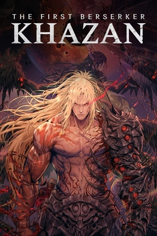
*   **《艾尔登法环：黑夜君临(Nightreign)》**：**年度最佳合作游戏**。和发小一起玩的，我俩在游戏发售前就约好了。这种默契不需要多说，虽然他技术菜点（笑），但我可以无伤带他。这游戏就是《怪物猎人：荒野》的完全体，量大管饱，无论是战斗体验还是更新频率，都是顶级的。唯一的遗憾是地图太大、时间太少，每次只能一点点探索，感觉永远探不完。
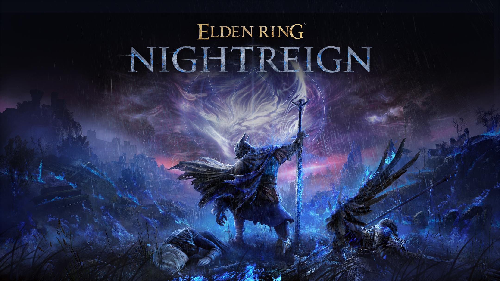
*   **《血源诅咒》（SteamDeck 模拟器版）**：在 SteamDeck 上用 shadPS4 模拟器玩的。虽然玩到了后面有点掉帧甚至闪退，但我依然愿意称它为神作。那种克苏鲁式的压抑氛围，亚楠的怪兽，味道太正了。排在《只狼》后面，绝对是我心目中魂系的第二名。可惜模拟器性能有限，还没玩到 DLC，等以后换个更好的设备一定要把 DLC 通了。
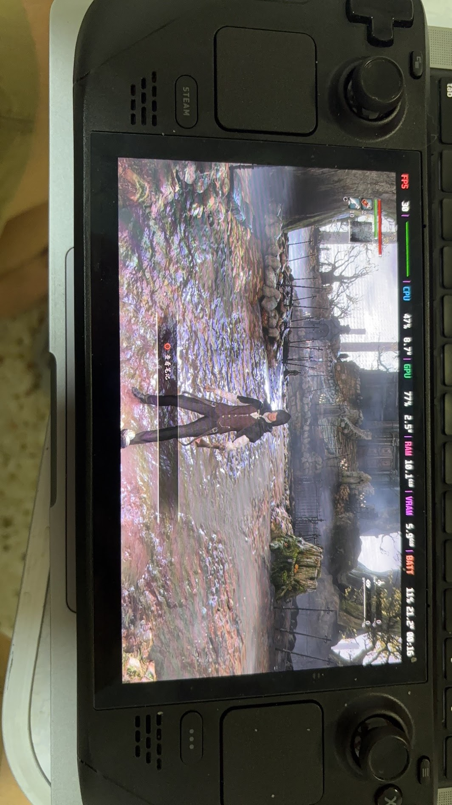
*   **《战神》（PSP版）**：为了弥补小时候没钱买 PSP 的遗憾，我在 SteamDeck 上装了模拟器，一口气通了《奥林匹斯之链》和《斯巴达之魂》。那时候的游戏真纯粹啊，没什么花里胡哨的系统，就是一个字：爽。
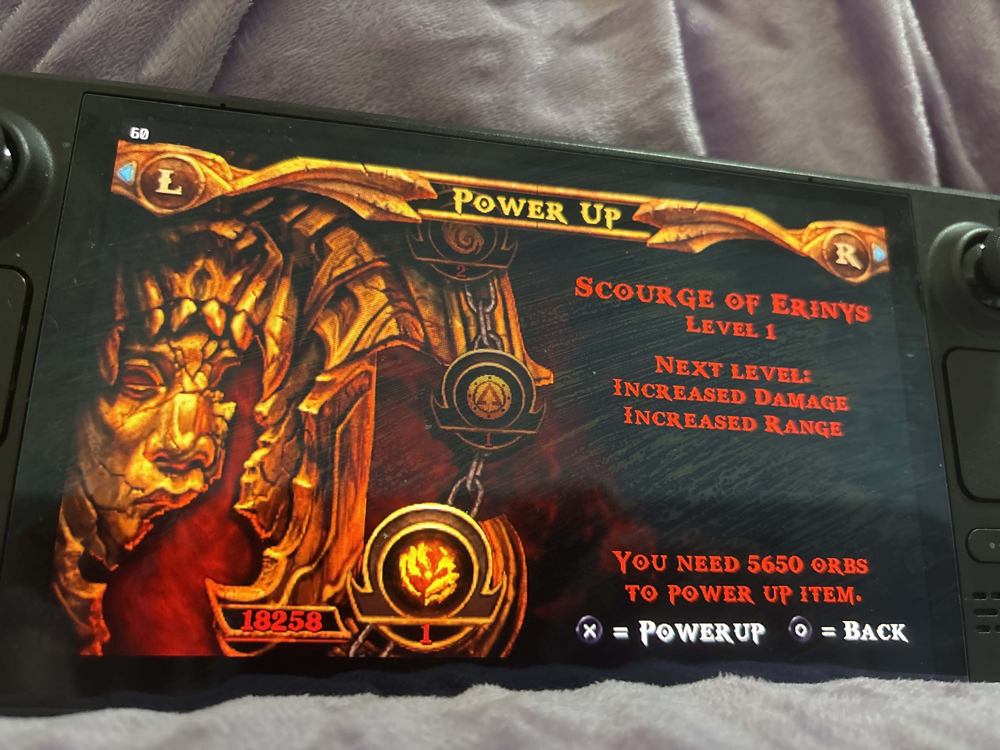
*   **《艾尔登法环 dlc》**: 去年玩到一半没玩，年底的时候通关了，法环的确是艺术品。
*   **《黑魂3 dlc》**: 顺带把黑魂3的dlc也通了，不说了， 又是 fs 社的一款艺术品。
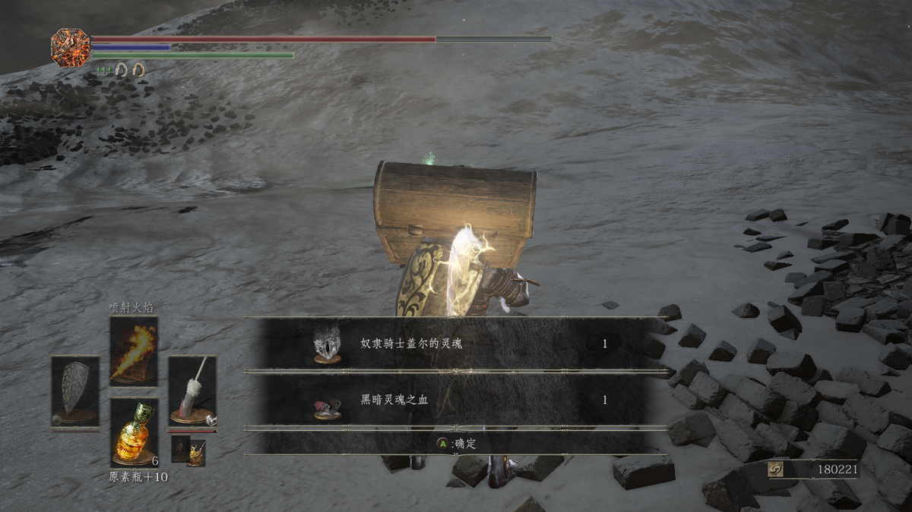

## 7. 旅行：日本的祛魅之旅

今年去了趟日本，东京、大阪、奈良、宇治、京都，一共玩了 16-17 天。
后半程明显感觉城市逛的有些枯燥审美疲劳，只想回坡打工。
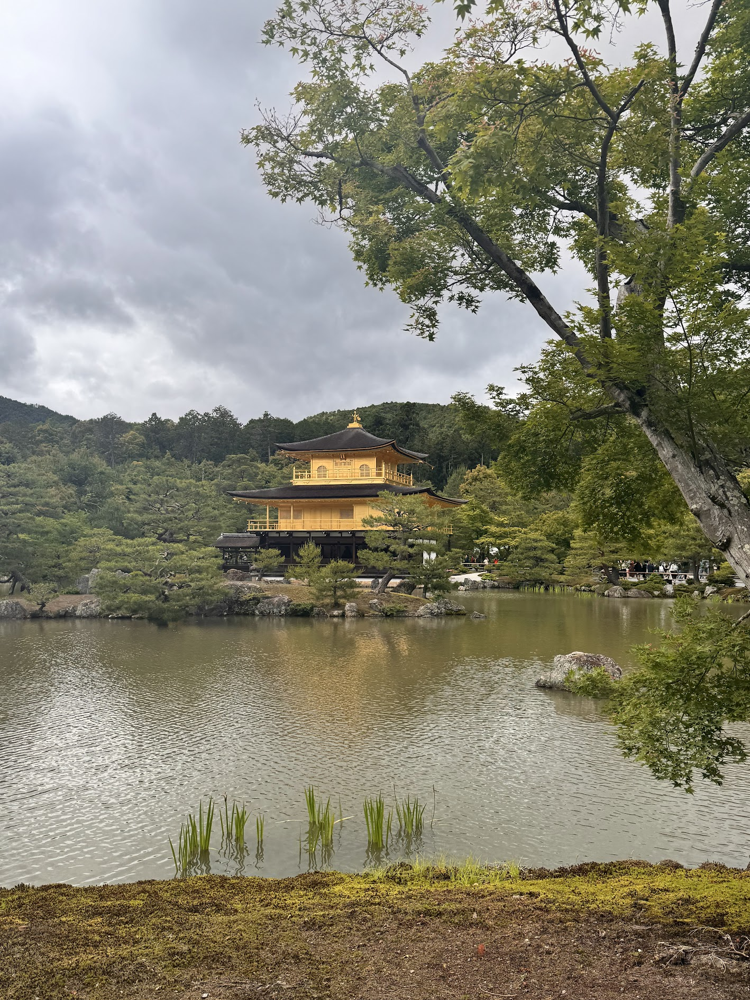
当然，日本的服务是真的好，这大概是很多新加坡本地人疯狂往日本跑的原因——在新加坡你只能买到商品，但在日本，同样的价格你能买到商品+顶级的服务。
但我自己应该不会再像这样深度游了。祛魅之后，日本对我来说更像是一个偶尔去进货（买买 HHKB、游戏碟）的地方，而不是精神故乡。未来的旅行，也许会更倾向于松弛一点的目的地。
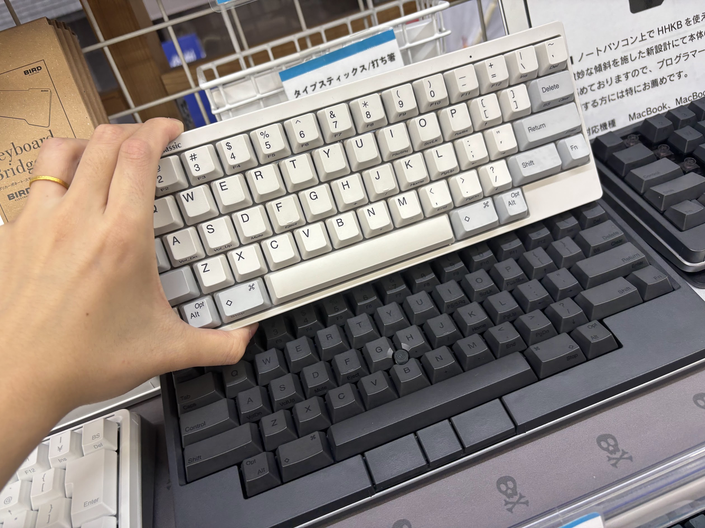

## 8. 身份：不是“熬”来的，是平平淡淡走出来的

**拿到身份**
今年生活层面最大的里程碑，是拿到了新加坡的身份。很感激能在全球右转的大潮中，抓住这个机会，落脚在一个相对稳定、安全的地方。
心态上的变化非常直观：找工作不再焦虑了，也不大担心丢工作会被赶回国。

**降噪与复杂度**
拿到身份也得益于我之前，降低生活的复杂度,做减法。以前为了维持某种状态必须做的那些周期性事务，能砍则砍。我也买了一些东西来解决具体的痛点。生活不需要那么多花哨的各种“必须”，简单点挺好。这样生活才过得自在简单，没有那么难熬才能最后守得云开见月明。

**关于移民的哲学**
拿到身份的那一刻，我突然悟出一个道理：**移民这事，不要急。**
如果你在一个地方待着，感觉不算太难熬，没有到那种数日子的程度，那就待着。只要时间到了，你在那里生活、缴税、存在，身份这个东西，最终是会自然而然落到你头上的。
当你不再为了身份而焦虑地去计算日子时，那最后一定会水到渠成的.

**健康一般**
虽然身份有着落了，但是健康一般。
可能是工作忙、下半年雨季降温，加上 MC（病假）请得有点多，感冒成了家常便饭。
本来坚持的一周三次力量训练，下半年因为忙，慢慢缩水成了一周两次，甚至有时候练完太累，连蛋白粉都忘了喝，饮食也没控制好。

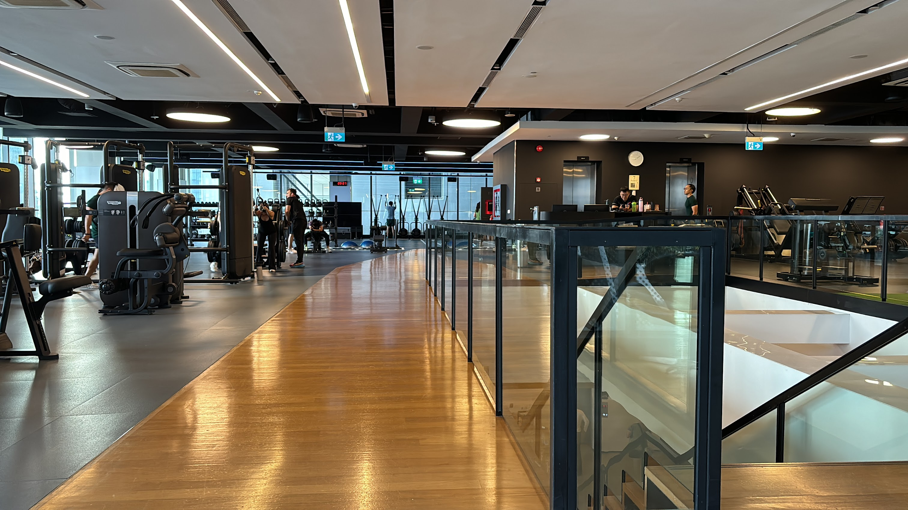
**2026 的Flag：** 把蛋白质摄入够，把身体练回来。

## 9. 写在最后

看着国内社交平台的收紧，越来越觉得，能有一块属于自己的、自由表达的自留地是多么重要。
希望看到这个博客的各位在2026年都能健康、快乐、平安。

明年见。
