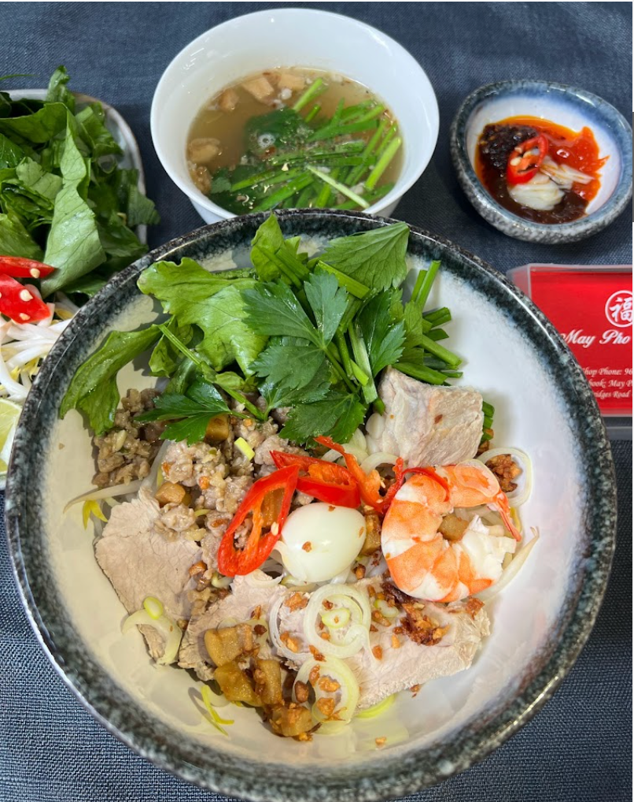
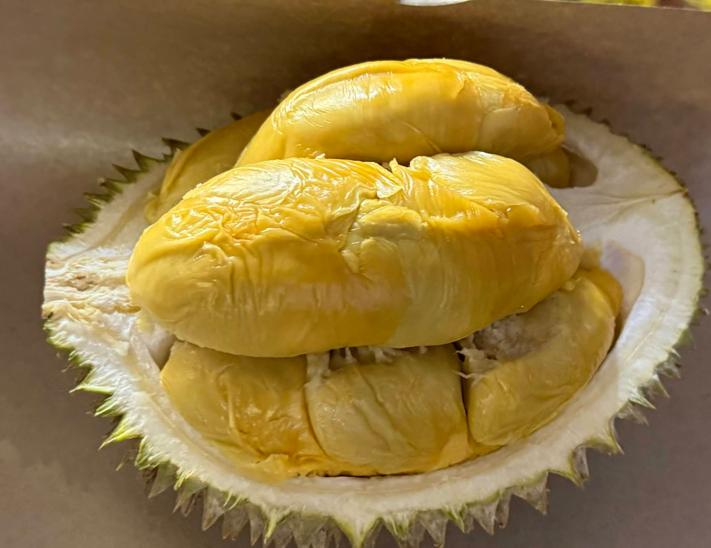
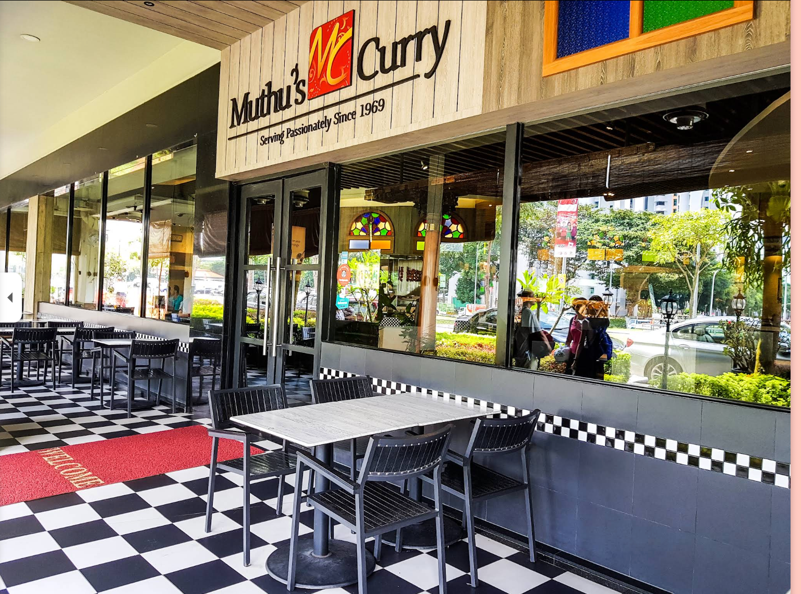

# 个人在新加坡和新山吃过最好的食物（持续更新）

因为我对象特别喜欢吃，并且我作为一个程序员虽然对吃没有太在行，但是我对于找餐厅做 research 是非常专业的。

## 新加坡

### May Pho Culture（越南河粉）
**地址**：150 South Bridge Rd, #01-16, Singapore 058727

**推荐理由**：这家越南河粉店的汤底醇厚浓郁，层次丰富。店内提供新鲜的越南香叶（罗勒叶），需要顾客自己一片片摘下放入河粉中，清香四溢，与浓郁的汤底完美融合。

---

### Bentong Durian Pte Ltd（猫山王榴莲）
**地址**：241 Holland Ave, #01-02, Singapore 278976

**推荐理由**：
1. **贴心服务**：采用 B 果（整果）榴莲，不让顾客挑选，直接开壳装盒。我购买的那盒 45 新元，店家开了两个 B 果猫山王，避免顾客挑到房数少的榴莲，充分为顾客着想。
2. **品质保证**：具备顶级榴莲摊的特点——不会在榴莲季刚开始就营业。因为季初很多猫山王会有些夹生，他们只在榴莲品质最佳时才开门迎客，保证每一颗榴莲都处于完美状态。

---

### Muthu's Curry
**地址**：138 Race Course Rd, #01-01, Singapore 218591
**推荐理由**：干净又卫生哈，他家的芒果拉西（Mango Lassi）特别好喝，Naan饼也很赞，Chicken Tikka 也很顶。

---

