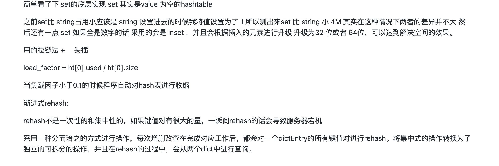

<!-- 
* 总是会先写一句话，同步背景和上下文
* 评论式写作引用一些大牛说的话
* 多一些有趣的跳转链接
* 在文章末尾推荐一些有趣的链接
* 先写提纲，再写内容 -->

> 记忆信息后寻找之间的联系才是人的价值。

之前向身边的朋友推荐双相链接的软件来记录八股文，很多人会来问我“为什么要用双向链接？有啥好处？” 。
我这边就写一篇短文，来统一回答这些问题。

我之前尝试了很多种笔记软件，例如 Notion，印象笔记等软件，甚至是直接用 git 来管理的 typora，其实很多时候都没有记笔记的动力。
原因主要是几点：

* 第二次去看笔记的时候并没有什么用，看上去就是一坨。如下：

* 写笔记的时候不知道写哪？这个文件夹还是那个文件夹？

* 笔记之间没有任何联系，没有任何关联性，知识点的复用性很低。写了只是写了而已。

我找到了双向链接，它是一种新的笔记方式，它可以让我们在笔记中直接查找到原来的知识点。

## 什么是双向链接？

双向链接，是指两篇笔记间的引用关系。例如：笔记 A 引用了笔记 B，同时笔记 B 也会自动引用笔记 A，则两篇笔记互相关联，就是双向链接，支持双向跳转。

## 双向链接的好处是？

我主要列举几点双向链接笔记的好处：

1. **复用性好**，当你写下一个词条之后，如果之后的笔记可以直接引用这个词条。

2. **无压记录**，因为你知道不断互相链接笔记能在之后的日子帮助到你，你会更加有动力去记录。同时你也不需要思考将笔记写到哪里，直接把相关的内容写到词条中就可以了，让他们互相链接。之后你可以很方便的找到笔记。

3. **便于内化**，当你打算写一篇文章，可能有很多概念，如果你之前有积累这些概念在双向链接笔记中，那么你可以直接引用这些概念。同时对于这个概念，你可以知道哪些笔记引用了这个概念。这样你就可以更加完整地找出你之前总结过知识点，从而输出一篇完整总结的文章。

## 例子

### 我想要学习一个知识点

前一段时间我在学习一个知识点是 `Golang Channel`，同时我阅读了相关的文章，例如： 《Channel Axioms》，《Golang Channels Tutorial》，《Effective Go》。

首先我会把 Channel 的概念写到双向链接笔记中：

### 做记录

对于每一篇文章，我都会在双向链接笔记中写一个词条，这个词条就是文章的标题，然后在词条中写上文章的笔记。
但是这笔记不是简简单单的拷贝上去，而是用自己的语言来写，需要自己去咀嚼一遍。例如上面的 Channel 的公理：

### 回顾

当你需要去做输出和回顾的时候，你只需要点开 Channel 这个词条，就可以找到之前所有引用 Channel 的笔记了。

这样的好处显而易见，在我们输出做提纲的时候，这里反向链接的笔记将很好的提供帮助。最初记录的时候词条很少，但是经过一段时间，我们就可以把词条写得更加完整了。同时在输出一篇文章之后成本会变得很低。

## 引用

* [Channel Axioms](https://dave.cheney.net/2014/03/19/channel-axioms)
* [双向链接与知识星图使用说明-Windows/Mac 端](https://staging.yinxiang.com/hc/articles/knowledge/)